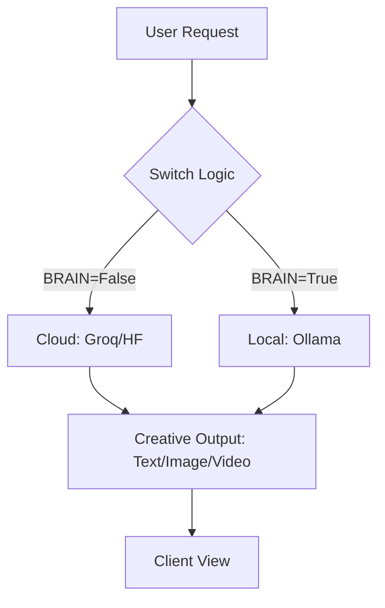

# AdGpt 
### Core Product for ImpactNexus

**AdGpt** is a high-performance, multimodal conversational AI platform designed for seamless automated content generation. It intelligently switches between high-speed Cloud inference and privacy-focused local models to deliver a robust, scalable experience.

## Why did I do this project?

Creating high-quality marketing content—such as text, images, and videos—is still difficult for many small businesses. They often have to rely on multiple disconnected tools, each with its own cost, learning curve, and limitations. This leads to inefficient workflows, inconsistent output quality, and higher expenses, making it harder for them to compete effectively.

Many people might ask: “Why not just use Google Gemini for image and video generation?”
The issue is that tools like Gemini solve only part of the problem. They don’t provide a unified, production-ready workflow, dynamic switching between cost-efficient local models and high-speed cloud models, or full backend control for integration and scaling.

I built this project to solve that gap by providing a single, unified platform for content generation. Instead of switching between different tools, users can generate everything in one place with a smooth, automated workflow. The system intelligently balances speed, cost, and privacy by switching between cloud-based and local AI models when needed.

The goal is simple: make high-quality ad creation faster, cheaper, and accessible—even for small companies without technical or design expertise.

##  The Solution
**AdGpt** provides a unified "Next-Gen Creative Suite" that orchestrates:
- **Multimodal Generation**: Native support for Text, Image, and Video.
- **Dynamic Brain Switching**: Auto-toggles between Cloud (Groq) for speed and Local (Ollama) for cost/privacy.
- **Production-Ready API**: A robust FastAPI backend for seamless integration.

##  Tech Stack
- **Backend**: Python, FastAPI, Uvicorn
- **AI Inference (Cloud)**: Groq (Llama 3.1), Hugging Face
- **AI Inference (Local)**: Ollama (Qwen 3.5)
- **Frontend**: HTML5, Vanilla CSS, JS

##  Workflow Diagram


##  Environment Configuration
Create a `.env` file in the root directory using the following template:

```env
# --- API Keys ---
GROQ_API_KEY=your_groq_key_here
HF_API_KEY=your_huggingface_key_here

# --- Model Selection ---
GROQ_MODEL=llama-3.1-8b-instant
OLLAMA_MODEL=qwen3.5:0.8b

# --- Server Config ---
PORT=8000
HOST=127.0.0.1

# --- Logic Switch ---
# BRAIN: True (Local/Ollama) | False (Cloud/Groq)
BRAIN=False
# ALLOW_GROQ_FALLBACK: Enable automatic fallback if local fails
ALLOW_GROQ_FALLBACK=False
```

##  Quick Start
1. **Clone & Setup**:
   ```bash
   git clone [repository-url]
   cd impactnexux
   ```
2. **Install Dependencies**:
   Download and install the necessary libraries using:
   ```bash
   pip install -r requirements.txt
   ```
3. **Configure**: Set up your `.env` file based on the template above.
4. **Launch**:
   ```bash
   python run.py
   ```

## Snaps shots


